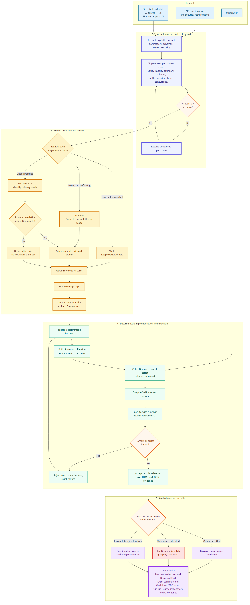

# HW06 API Testing Report

## Submission identity and scope

- Student ID: `23127414`
- Public GitHub repository: <https://github.com/luanthuco11/hw06-api-testing>
- SUT: `ttbhanh/eshop-sut` at commit `85af3ba875c88283615e22cb108f13e2fccaf0e9`
- Tools: Postman and Newman 6.2.2
- Required attribution: collection-level script inserts and logs `X-Student-Id: 23127414`
- Selected features: FR-01 Account Registration, FR-11 User Order History, and all four FR-14 Category CRUD endpoints

## Coverage and execution summary

| Endpoint | AI | Human | Cases | Requests | Assertions passed | Assertions failed | Failing cases | Defect candidates |
| --- | ---: | ---: | ---: | ---: | ---: | ---: | ---: | ---: |
| `POST /api/register` | 40 | 5 | 45 | 155 | 54 | 30 | 29 | 4 |
| `GET /api/orders/my-orders` | 40 | 7 | 47 | 71 | 35 | 14 | 14 | 5 |
| `GET /api/categories` | 40 | 6 | 46 | 75 | 47 | 1 | 1 | 1 |
| `POST /api/categories` | 40 | 7 | 47 | 93 | 32 | 25 | 25 | 5 |
| `PUT /api/categories/:id` | 40 | 7 | 47 | 75 | 30 | 29 | 29 | 6 |
| `DELETE /api/categories/:id` | 40 | 7 | 47 | 116 | 49 | 37 | 24 | 6 |
| **Total** | **240** | **39** | **279** | **585** | **247** | **136** | **122** | **27** |

The 279-case interpretation follows the student's explicit decision that the minimum applies independently to every endpoint. Seven FR-11 setup items are excluded from case counts but their HTTP requests are included in execution totals.

## Human audit summary

| Endpoint | VALID | INVALID and corrected | INCOMPLETE observation | Total AI cases |
| --- | ---: | ---: | ---: | ---: |
| FR-01 Register | 33 | 3 | 4 | 40 |
| FR-11 Order History | 36 | 2 | 2 | 40 |
| FR-14 GET | 34 | 0 | 6 | 40 |
| FR-14 POST | 38 | 0 | 2 | 40 |
| FR-14 PUT | 38 | 0 | 2 | 40 |
| FR-14 DELETE | 40 | 0 | 0 | 40 |
| **Total** | **219** | **5** | **16** | **240** |

Invalid AI cases were corrected during human review before implementation. Incomplete cases were executed only as observations and did not independently establish defects.

## Principal findings

1. Registration lacks server-side name, email, and password validation; duplicate emails are accepted; credentials are exposed in plaintext; parser errors disclose internal paths.
2. Order history exposes fields outside the approved schema, accepts malformed authorization schemes, authorizes deleted principals, trusts semantically invalid JWT claims, and is exploitable with the hard-coded signing secret.
3. Category GET meets almost all selected behavior but ignores the approved `Accept: text/html → 406` rule.
4. Category POST and PUT do not validate or normalize names and do not enforce admin-only authorization.
5. Category PUT and DELETE report success for nonexistent or malformed IDs because affected-row counts are not checked.
6. Category DELETE permits orphaned products and ignores forbidden body/media input.

Detailed evidence, affected IDs, actual/expected results, and severity proposals are in each endpoint's `execution-results.md` and in `docs/bug-summary.md`.

## Reproducibility controls

- The SUT is pinned to a full commit SHA.
- Stateful cases use deterministic SQLite fixtures prepared only after server startup.
- Cardinality-sensitive GET/DELETE cases run in separate fixture modes.
- Database backups are stored outside the submission repo and restored after every run.
- Generated Postman scripts are compiled before execution where possible.
- One invalid POST harness run was rejected, corrected, reset, and rerun; it is not included in totals.
- HTML Newman reports are committed; raw JSON stays under the local `.runtime` diagnostics directory.

## CI and Agent Skill

- CI retains the known-good smoke pass/fail demonstration and also executes the complete 279-case audited suite against its exact accepted baseline.
- Public pass/fail/full-suite run links are recorded in `docs/ci-evidence.md`, and the final branch is green without hiding the known SUT failures.
- `agent-skill/audited-api-test-workflow` packages the audit and evidence process. Its structure and scripts were validated against this submission.
- The complete truthful list of exercised Postman/Newman features is in `docs/postman-features.md`.
- Generator pseudocode is in `docs/agent-skill-pseudocode.md`; the student-reviewed Mermaid source and PNG are in `docs/agent-skill-diagram.mmd` and `docs/agent-skill-diagram.png`.

## Self-assessment

| No. | Official criterion | Maximum | Self-assessed grade |
| ---: | --- | ---: | ---: |
| 1 | API 1 — full pipeline | 30 | 30 |
| 2 | API 2 — full pipeline | 30 | 30 |
| 3 | API 3 — full pipeline | 30 | 30 |
| 4 | Agent Skill — AI-driven test generator | 10 | 10 |
| | **Total** | **100** | **100** |

The student selected 100/100 after reviewing the completed evidence. The final package is named `23127414_HW06_AI_API_100.zip`.

## Final evidence status

The diagram, 30 screenshots, 27 published GitHub Issues, full-suite CI, AI audit, Markdown/PDF reports, Excel workbook, commit log, and self-assessment are complete. AI interaction times use the nearest verifiable Git commit timestamps as approximate recorded times; they are not represented as exact prompt-send times.

The Agent Skill demonstration video is encouraged by the assignment and can be added as optional supporting evidence.

\newpage

# Postman and Newman Features Used

| Feature | How it is used | Evidence |
| --- | --- | --- |
| Collection and folders | One exported collection groups each independently counted endpoint, setup steps, audited AI cases, and human-added cases. | `postman/eshop-hw06.postman_collection.json` |
| Collection variables | Stores `baseUrl`, `studentId`, login tokens, and state shared by requests. | Full collection variables and test scripts |
| Environment | Supplies the local execution base URL and student identity to Newman. | `postman/local.postman_environment.json` |
| Collection pre-request script | Upserts and logs `X-Student-Id: 23127414` for every top-level request. | Collection-level `prerequest` event and Newman console output |
| Request headers and raw bodies | Exercises Authorization, Content-Type, Accept, CORS, method override, malformed JSON, and adversarial values. | Per-case requests in the collection |
| Test scripts and Chai assertions | Validates status, exact schema, types, values, headers, isolation, persistence, and non-mutation. | Per-request `test` events and Newman HTML reports |
| `pm.sendRequest` workflows | Performs follow-up reads, replay, state transitions, authentication setup, and concurrent requests inside one attributable case. | FR-01, FR-11, and FR-14 workflow cases |
| Collection variables at runtime | Saves login JWTs for authenticated follow-up requests. | FR-11 setup folder and CI smoke collection |
| Folder selection | Runs only the folder matching a prepared deterministic fixture. | Newman commands documented in endpoint reports |
| Multiple reporters | Produces CLI, JSON, JUnit, and htmlextra HTML outputs for diagnostics, CI, and submission evidence. | `reports/newman`, `.runtime`, and GitHub Actions artifact |
| Newman CLI integration | Executes exported Postman artifacts reproducibly outside the GUI. | npm scripts and execution metadata |
| CI/CD execution | GitHub Actions installs the pinned SUT, runs the smoke collection, executes all 12 deterministic full-suite modes, and verifies the exact accepted baseline. | `.github/workflows/api-smoke.yml`, `scripts/run-full-ci-suite.js`, and public run links |

Postman monitors, mock servers, and cloud workspaces were not claimed because they were not needed for a local, deterministic SQLite SUT and no attributable execution evidence was produced for them.

\newpage

# Confirmed Defect Candidate Summary

- Published Issues: <https://github.com/luanthuco11/hw06-api-testing/issues>
- Representative screenshots: [`evidence`](../evidence)

| ID | Endpoint | Finding | Proposed severity |
| --- | --- | --- | --- |
| BUG-FR01-001 | Register | Missing server-side field validation | High |
| BUG-FR01-002 | Register | Email uniqueness not enforced atomically | High |
| BUG-FR01-003 | Register/Login | Plaintext password storage/exposure | Critical |
| BUG-FR01-004 | Register | Parser stack disclosure and wrong media status | High |
| BUG-FR11-001 | Order history | Response violates strict/minimized schema | Medium |
| BUG-FR11-002 | Order history | Authorization scheme parsing is inconsistent | High |
| BUG-FR11-003 | Order history | Deleted/nonexistent principals remain authorized | High |
| BUG-FR11-004 | Order history | Hard-coded signing secret enables forged-token IDOR | Critical |
| BUG-FR11-005 | Order history | JWT claims lack semantic validation | High |
| BUG-FR14GET-001 | Category GET | Unacceptable HTML media is ignored | Low |
| BUG-FR14POST-001 | Category POST | Name validation/normalization/extra-field policy absent | High |
| BUG-FR14POST-002 | Category POST | Parser/media errors disclose internals or return 500 | High |
| BUG-FR14POST-003 | Category POST | Admin authorization not enforced | Critical |
| BUG-FR14POST-004 | Category POST | Empty Authorization classified incorrectly | Low |
| BUG-FR14POST-005 | Category POST | Unacceptable response media is ignored | Low |
| BUG-FR14PUT-001 | Category PUT | Name validation/normalization/extra-field policy absent | High |
| BUG-FR14PUT-002 | Category PUT | Parser/media errors disclose internals or return 500 | High |
| BUG-FR14PUT-003 | Category PUT | Invalid/nonexistent IDs falsely report success | Medium |
| BUG-FR14PUT-004 | Category PUT | Admin authorization not enforced | Critical |
| BUG-FR14PUT-005 | Category PUT | Empty Authorization classified incorrectly | Low |
| BUG-FR14PUT-006 | Category PUT | Unacceptable response media is ignored | Low |
| BUG-FR14DELETE-001 | Category DELETE | ID coercion and affected-row checks allow false/unintended deletion | High |
| BUG-FR14DELETE-002 | Category DELETE | Admin authorization not enforced | Critical |
| BUG-FR14DELETE-003 | Category DELETE | Referenced category deletion creates orphan products | High |
| BUG-FR14DELETE-004 | Category DELETE | Unexpected bodies/media are ignored | Medium |
| BUG-FR14DELETE-005 | Category DELETE | Empty Authorization classified incorrectly | Low |
| BUG-FR14DELETE-006 | Category DELETE | Unacceptable response media is ignored | Low |

These 27 endpoint-attributable candidates are published as GitHub Issues. Each Issue contains one representative screenshot; affected test IDs and full evidence remain in the endpoint execution reports.

\newpage

# AI Audit Report

## Declaration

I use AI tools for the following tasks.

## Session log

| Date | AI tool | Student prompt / instruction | AI output and resulting action | Human review |
| --- | --- | --- | --- | --- |
| 2026-09-02 | OpenAI Codex | Read the HW06 PDF, create an empty GitHub repository, and prepare a plan without making unapproved decisions. | Read the eight-page assignment, created the public empty repository `luanthuco11/hw06-api-testing`, and identified decisions required from the student. | Student confirmed repository owner, name, visibility, student ID, tools, feature scope, and Agent Skill/video scope. |
| 2026-09-02 | OpenAI Codex | Read HW2 to determine the previously selected pools/features. | Identified FR-01 from Pool A, FR-11 from Pool B, FR-14 from Pool C, and FR-02 Mobile from Pool D. | Student confirmed reuse of FR-01, FR-11, and all FR-14 CRUD operations. |
| 2026-09-02 | OpenAI Codex | Clone the teacher SUT and the assignment repository, then verify the backend. | Cloned both repositories, installed backend dependencies, seeded SQLite, and smoke-tested categories, login/JWT, and personal order history using `X-Student-Id: 23127414`. | Execution results were checked against terminal output; no assignment test cases were claimed at this stage. |
| 2026-09-02 | OpenAI Codex | Continue the assignment. | Created the initial repository structure, scope, execution plan, evidence rules, and Newman tool configuration. | Pending student review of generated test cases and final deliverables. |
| 2026-09-02 | OpenAI Codex | `Tiếp tục làm bài đi` (continue the assignment), following the previously approved FR-01 → FR-11 → FR-14 pipeline. | For FR-01, extracted the contract, partitioned each input and security/schema concern, and generated 40 unreviewed cases in `test-cases/fr01-register/ai-generated.md`. | Human audit and student acceptance are explicitly pending; no generated case is yet claimed as valid or executed. |
| 2026-09-02 | OpenAI Codex | Student clarified: email uniqueness is case-sensitive; invalid input uses detailed 400/409/415 status codes; one/255/256-character names remain specification gaps. | Audited all 40 FR-01 cases as 33 VALID, 3 INVALID, and 4 INCOMPLETE; corrected the three invalid cases without hiding the original AI output. | Student explicitly approved the three specification-gap cases and the two oracle conventions before the audit was recorded. |
| 2026-09-02 | OpenAI Codex | Student selected extension candidates `1 2 4 5 7`: concurrent duplicates, retry after validation failure, prototype pollution, oversized body, and registration burst/rate limiting. | Converted the five selected ideas into reproducible FR-01 cases and distinguished specification defects from exploratory hardening findings. | The student made the case selection; AI supplied structured steps, oracle boundaries, and explanations of the original omissions. |
| 2026-09-02 | OpenAI Codex | Continue implementation and execute the approved FR-01 cases with Postman/Newman. | Built a collection containing 45 FR-01 items, inserted the student header in a collection pre-request script, reset the SUT to a deterministic database, and executed 155 real requests. Newman recorded 84 assertions: 54 passed and 30 failed across 29 cases. | Results were derived from Newman JSON/HTML output. Four defect candidates were separated from specification-gap and hardening observations; GitHub issue publication awaits real screenshots. |
| 2026-09-02 | OpenAI Codex | Continue with the approved FR-11 User Order History pipeline. | Partitioned authentication, ownership, order data, schema, and robustness, then generated 40 unreviewed cases in `test-cases/fr11-order-history/ai-generated.md`. | Human audit and resolution of underspecified response/authentication behavior are pending. |
| 2026-09-02 | OpenAI Codex | Student approved 401/403 authentication mapping, 404 for a deleted principal and unsupported POST, and accepted the proposed strict four-field order schema. | Audited all 40 FR-11 cases as 36 VALID, 2 INVALID, and 2 INCOMPLETE; corrected the address/schema contradiction and the ineffective SQL-injection claim. | The student explicitly made or approved all ambiguous oracle decisions before the audit commit. |
| 2026-09-03 | OpenAI Codex | Student selected all FR-11 extension candidates: `1 2 3 4 5 6 7`. | Structured seven reproducible human-added cases covering forged JWTs, missing/invalid claims, response caching, token smuggling, deletion races, and large-history cross-user isolation. | Student made the selection; AI documented steps, bounded oracles, and why the initial generation missed each case. |
| 2026-09-03 | OpenAI Codex | Implement and execute the approved FR-11 set with Postman/Newman. | Built deterministic multi-user/order fixtures and 47 FR-11 collection items. The first run was rejected after five fixture logins exposed an ordering mistake: SUT startup had reset the preloaded database. The corrected run started SUT, then seeded data, verified all logins, and executed 71 requests/49 assertions with 35 passing and 14 failing. | Only the corrected run is reported. Five defect candidates and one hardening observation were derived from its JSON/HTML evidence; screenshots and GitHub Issues remain pending. |
| 2026-09-03 | OpenAI Codex | Continue with the first independently counted FR-14 endpoint, `GET /api/categories`. | Generated 40 unreviewed cases spanning data states, strict schema, Unicode/adversarial stored values, public access, query isolation, concurrency, HTTP behavior, and non-mutation. | Human audit and decisions on strict schema and unspecified HTTP/cache behavior are pending. |
| 2026-09-03 | OpenAI Codex | Student approved strict `id/name` schema, ignore-and-200 for unknown queries, 406 for HTML Accept, and observation-only handling for unspecified behavior. Student also authorized autonomous selection of added cases and routine commits. | Audited the 40 GET Category cases as 34 VALID and 6 INCOMPLETE, correcting the ambiguous Accept oracle while preserving all specification gaps. | Decisions were explicitly approved before recording the audit. |
| 2026-09-03 | OpenAI Codex | Select at least five human-added cases for `GET /api/categories` under the student's authorization. | Added six bounded cases for parameter pollution, nested query parsing, method override, stored CRLF response splitting, read/write concurrency, and 10,000-row integrity. | Performance remains observational; the cases use only student-approved query and schema oracles. |
| 2026-09-03 | OpenAI Codex | Implement and execute all audited `GET /api/categories` cases with Postman/Newman. | Built six deterministic fixture modes and 46 collection items. Executed 75 HTTP requests and 48 assertions: 47 passed and one failed. | The only confirmed mismatch is HTTP 200 instead of the approved 406 for `Accept: text/html`; incomplete cache/performance/corrupt-data oracles remain observations. |
| 2026-09-03 | OpenAI Codex | Continue with the independently counted `POST /api/categories` endpoint. | Generated 40 unreviewed cases spanning valid names, validation and media handling, admin authorization, privilege bypass, duplicate policy, injection, atomicity, response schema, and content negotiation. | Length, whitespace normalization, extra-field handling, and three duplicate policies remain explicitly unresolved for human review. |
| 2026-09-03 | OpenAI Codex | Student selected POST oracles: whitespace-only is 400, trim surrounding whitespace, allow duplicate names, and reject any extra field with 400. | Audited the 40 generated POST cases as 38 VALID and 2 INCOMPLETE. Replaced all alternative outcomes with the approved deterministic behavior. | Only the unspecified 255/256-character name limits remain observational. |
| 2026-09-03 | OpenAI Codex | Select human-added cases for `POST /api/categories` under the student's authorization. | Added seven cases for forged/stale admin claims, duplicate JSON keys, prototype-shaped input, wrong JSON root type, permitted replay, and mixed-validity concurrency. | Every oracle follows the approved admin, validation, extra-field, trim, and duplicate rules. |
| 2026-09-03 | OpenAI Codex | Implement and execute all audited `POST /api/categories` cases with Postman/Newman. | Rejected an initial run containing four test-script syntax errors, compiled the corrected 47 scripts, reset the fixture, and reran 47 cases/93 requests/57 assertions. The valid run produced 32 passing and 25 failing assertions with zero script failures. | Failures were consolidated into validation, parser/media, admin authorization, empty-auth, and Accept defect candidates; length cases remain observations. |
| 2026-09-03 | OpenAI Codex | Continue with the independently counted `PUT /api/categories/:id` endpoint. | Generated 40 unreviewed cases covering rename semantics, inherited name validation, identifier partitions, media/authentication, privilege bypass, duplicates, injection, response schema, and concurrency. | Nonexistent and malformed identifier status codes remain unresolved for student review; maximum lengths remain observational. |
| 2026-09-03 | OpenAI Codex | Student approved all proposed PUT oracles: 404 for nonexistent positive IDs, 400 for invalid IDs, and exact `200 {"message":"Category updated"}` success. | Audited 40 generated cases as 38 VALID and 2 INCOMPLETE, retaining only unspecified name lengths as observations. | Existing POST rules were carried forward consistently as explicitly stated before approval. |
| 2026-09-03 | OpenAI Codex | Select PUT human-added cases under the student's authorization. | Added seven cases covering forged/stale admin roles, duplicate/prototype JSON fields, idempotent replay, update/delete race, and product-reference stability. | All added cases use previously approved or specification-derived behavior. |
| 2026-09-03 | OpenAI Codex | Implement and execute all audited `PUT /api/categories/:id` cases with Postman/Newman. | Built a 48-row isolated fixture plus a product sentinel, compiled 47 scripts, and executed 47 cases/75 requests/59 assertions. The run produced 30 passing and 29 failing assertions with zero script failures. | Failures were grouped into validation, parser/media, identifier, admin authorization, empty-auth, and Accept defects; concurrent ordering and maximum lengths remain observations. |
| 2026-09-03 | OpenAI Codex | Continue with the independently counted `DELETE /api/categories/:id` endpoint. | Generated 40 unreviewed cases covering targeting, identifier/path partitions, admin authorization, response/repeat/concurrency behavior, referential integrity, query/body/media handling, CORS, and non-resurrection. | Success body, referenced-category policy, encoded plus IDs, and DELETE-body/media handling remain unresolved for student review. |
| 2026-09-03 | OpenAI Codex | Student approved DELETE oracles: exact 200 success body, 409/no deletion for referenced categories, 400 for encoded-plus IDs, allow empty object, reject body fields with 400, and reject text/plain body with 415. | Audited all 40 generated DELETE cases as VALID with no remaining incomplete oracle. | Existing identifier/admin/Accept conventions were carried forward as explicitly stated before approval. |
| 2026-09-03 | OpenAI Codex | Select DELETE human-added cases under the student's authorization. | Added seven cases for forged/stale/missing-role tokens, credential smuggling, duplicate/prototype body fields, and a 4,096-digit ID. | Every expected result follows the approved authorization, body, and identifier rules. |
| 2026-09-03 | OpenAI Codex | Implement and execute all audited `DELETE /api/categories/:id` cases with Postman/Newman. | Split the one-category postcondition from the 80-row fixture, compiled 47 scripts, and executed 47 cases/116 requests/86 assertions. The valid runs produced 49 passing and 37 failing assertions across 24 failing cases, with zero script failures. | Failures were grouped into ID/affected-row validation, admin authorization, referential integrity, body/media, empty-auth, and Accept defects. |
| 2026-09-03 | OpenAI Codex with `skill-creator` | Package the completed approach as a reusable Agent Skill. | Created `audited-api-test-workflow` with a strict human-oracle workflow, review checklist, collection validator, and multi-report Newman summarizer. Validated the skill and forward-tested both scripts on this submission. | The validator confirmed every endpoint has at least 35 AI and 5 human cases; the summarizer independently derived 279 cases, 585 requests, and 383 assertions. |
| 2026-09-03 | OpenAI Codex | Implement the required CI pass/fail demonstration without hiding contract defects. | Added a three-request Newman smoke workflow pinned to the teacher SUT commit. Verified run 33666325233 succeeded, changed one expected status to 418 for run 33708693475 to fail, then restored 200. | Full conformance failures remain unchanged; CI evidence uses public immutable run links and explicitly documents the intentional delta. |
| 2026-09-03 | OpenAI Codex | Prepare the final report sources, truthful Postman feature inventory, generator pseudocode, Excel workbook, and PDF. | Aggregated accepted Newman JSON into 279 test rows, 585 requests, 383 assertions, and 27 endpoint-attributable defect candidates. Generated a four-sheet workbook and a Unicode PDF containing the report, Postman features, bugs, AI audit, 239-word critique, CI evidence, and pseudocode. | The first deliverable-generation attempt stopped on a defect-table regex error; after correction, outputs were structurally validated. |
| 2026-09-03 | OpenAI Codex | Read the assignment and completed folder again, then identify what remained. | Compared the eight-page assignment with the repository and identified the diagram, screenshots/Issues, broader CI evidence, AI time traceability, self-grade, and final ZIP as remaining or weak evidence. | Student chose to continue sequentially and confirmed the teacher permits AI-assisted diagram generation if the student reviews it. |
| 2026-09-03 | OpenAI Codex | Produce Mermaid code for the required Agent Skill/test-generator diagram. | Created editable Mermaid source and a rendered high-resolution PNG describing contract extraction, AI generation, human audit/correction, fixtures, Newman execution, defect grouping, reporting, and feedback. | Student reviewed the generated diagram and confirmed completion. |
| 2026-09-03 | OpenAI Codex | Continue after the student added one representative screenshot per defect. | Verified 30 evidence images, published 27 GitHub Issues from the reviewed drafts, embedded the corresponding representative screenshot in every Issue, and removed all publication placeholders. | Student stated that one representative screenshot per case/Issue was intentional; samples were inspected for readable case/result context. |
| 2026-09-03 | OpenAI Codex | Continue to the next missing requirement. | Extended GitHub Actions to execute all 12 deterministic fixture modes and compare 279 cases, 585 requests, 383 assertions, and all failing case IDs with the accepted baseline. Public run 33716503581 passed. | Green is explicitly defined as exact reproducibility with zero request/script failures; the known 136 SUT assertion failures remain visible rather than being suppressed. |
| 2026-09-03 | OpenAI Codex | Student selected a self-assessed grade of 100 and approved commit timestamps as sufficient approximate time evidence. | Recorded 30/30/30/10 rubric points, added commit-based time traceability, regenerated final deliverables, and prepared `23127414_HW06_AI_API_100.zip`. | Student explicitly selected the grade and accepted approximate recorded times; no exact prompt time was invented. |

## Time traceability

Exact prompt-send times were not retained. With the student's approval, the nearest Git commit time is used as the approximate recorded time for each implemented AI-assisted stage. The complete timestamped history is preserved in [`reports/commit-log.txt`](../reports/commit-log.txt). Key checkpoints in ICT (`+07:00`) are:

| Stage | Approximate recorded time | Commit |
| --- | --- | --- |
| Repository and scope setup | 2026-09-02 23:31 | `9f5302c` |
| FR-01 generation through execution | 2026-09-02 23:33–23:51 | `1053201`–`306ac38` |
| FR-11 generation through execution | 2026-09-02 23:55–2026-09-03 00:06 | `6aa20c4`–`3c3b436` |
| FR-14 GET generation through execution | 2026-09-03 00:07–00:45 | `0021361`–`7b3f11c` |
| FR-14 POST generation through execution | 2026-09-03 00:47–00:56 | `0111494`–`8953985` |
| FR-14 PUT generation through execution | 2026-09-03 00:57–01:03 | `7957f58`–`584336b` |
| FR-14 DELETE generation through execution | 2026-09-03 01:05–01:13 | `552cc2b`–`d6aacd4` |
| Agent Skill implementation | 2026-09-03 01:15 | `2cb8202` |
| CI pass/fail demonstration | 2026-09-03 01:17–09:46 | `2aa67f6`–`eb779bd` |
| Reports and defect drafts | 2026-09-03 09:57–10:08 | `296ccec`–`373fefa` |
| Diagram, screenshots, and published Issues | 2026-09-03 11:38 | `ecde5b3` |
| Full audited-suite CI | 2026-09-03 11:50 | `c13d9a4` |
| Final evidence/report refresh | 2026-09-03 12:02–12:03 | `ba647f7`–`faa01da` |

These timestamps establish when the corresponding work was recorded in version control. They are intentionally labeled approximate and do not pretend to be exact interaction timestamps.

\newpage

# AI Critique

AI was most useful for breadth and mechanical consistency. It quickly partitioned inputs, authentication states, media types, concurrency, schemas, and injection payloads across six endpoints. It also helped generate repeatable Postman scripts and fixtures, which made 279 cases practical. However, the initial output was not trustworthy without human review. Five generated cases were invalid because they contradicted the chosen schema or mixed two concerns, and sixteen were incomplete because the requirements did not define a boundary, cache rule, recovery behavior, or performance threshold.

The most important human contribution was establishing explicit oracles. Decisions about case-sensitive email uniqueness, strict response fields, 400/401/403/404/406/409/415 statuses, whitespace trimming, duplicate category names, extra fields, and referenced-category deletion changed the meaning of many tests. Without those choices, AI could have produced apparently precise but fabricated failures. Human-added tests also found deeper risks that the first generation missed, particularly forged JWTs using the hard-coded secret, semantic claim validation, response-header injection, token smuggling, lifecycle races, and referential integrity.

AI also introduced a concrete harness defect: four duplicate-workflow scripts had invalid parentheses. That first POST run was discarded, the scripts were compiled, the fixture was reset, and the suite was rerun. This demonstrates why generated tests themselves require validation. Overall, AI substantially increased coverage and documentation speed, while human judgment remained responsible for requirements interpretation, defect legitimacy, and evidence quality. The safest workflow is therefore generation, explicit audit, deterministic execution, and root-cause review—not direct acceptance of generated cases.

\newpage

# GitHub Actions CI Evidence

## Workflow

- Workflow: `API smoke`
- SUT: teacher repository pinned to commit `85af3ba875c88283615e22cb108f13e2fccaf0e9`
- Runner: Ubuntu with Node.js 22 and Newman 6.2.2
- Attribution: collection pre-request script logs `X-Student-Id: 23127414` for every request
- Scope: a three-request smoke collection demonstrates ordinary pass/fail behavior. A second step executes the complete audited suite and compares its exact results with the accepted baseline without relabeling known contract failures as passes.

## Required pass/fail history

| Purpose | Commit | Run | Result |
| --- | --- | --- | --- |
| Initial all-pass run | `2aa67f6` | [GitHub Actions run 33666325233](https://github.com/luanthuco11/hw06-api-testing/actions/runs/33666325233) | Success |
| Intentional one-fail demonstration | `ee9c636` | [GitHub Actions run 33708693475](https://github.com/luanthuco11/hw06-api-testing/actions/runs/33708693475) | Failure |
| Final restored run | `eb779bd` | [GitHub Actions run 33708895230](https://github.com/luanthuco11/hw06-api-testing/actions/runs/33708895230) | Success |

The failing commit changed only `ciExpectedStatus` from 200 to 418. Therefore CI-001 produced one intentional assertion failure while the remaining smoke assertions stayed valid. The next commit restored 200, and the final public run confirms that the repository returned to green.

## Complete audited-suite CI

| Commit | Run | Result | Verified scope |
| --- | --- | --- | --- |
| `c13d9a4` | [GitHub Actions run 33716503581](https://github.com/luanthuco11/hw06-api-testing/actions/runs/33716503581) | Success | 12 deterministic executions; 279 cases; 585 requests; 383 assertions; 247 passed and 136 known failed assertions |

The full-suite step prepares each deterministic database fixture, runs all selected folders, rejects request/script/infrastructure failures, and compares every aggregate metric and failing case ID with `reports/execution-summary.json`. Green therefore means the audited behavior is reproducible and unchanged, not that the 136 confirmed SUT contract mismatches disappeared.

Captured UI evidence is committed as [`02-ci-passing-run.png`](../evidence/02-ci-passing-run.png) and [`03-ci-failing-run.png`](../evidence/03-ci-failing-run.png). The public run links remain the authoritative, immutable evidence.

\newpage

# Audited API Test Generator — Pseudocode

```text
INPUT: API specification, selected endpoint, required AI count,
       required human count, student ID, runnable SUT

contract := extract_explicit_requirements(specification, endpoint)
implementation_notes := inspect_SUT_only_for_fixture_and_execution_details()

ai_cases := generate_partitioned_cases(
    contract,
    domains = [valid, invalid, boundary, schema, auth, security,
               state, concurrency, media, non_mutation]
)
assert count(ai_cases) >= required_AI_count

FOR each case IN ai_cases:
    IF expected_result follows explicit contract:
        case.verdict := VALID
    ELSE IF case contradicts contract or combines unrelated concerns:
        case.verdict := INVALID
        case := human_correct(case)
    ELSE:
        case.verdict := INCOMPLETE
        ask_student_for_material_oracle(case)
        IF student decides:
            case := apply_student_oracle(case)
        ELSE:
            case.mode := OBSERVATION_ONLY

human_cases := student_select_or_authorize_additional_cases(
    gaps_in(ai_cases), minimum = required_human_count
)

fixture_plan := create_deterministic_fixture_plan(ai_cases + human_cases)
start_SUT()
FOR each independent fixture_mode IN fixture_plan:
    seed_after_startup(fixture_mode)
    collection_folder := build_postman_requests_and_assertions(fixture_mode)
    validate_student_header(collection_folder, student_ID)
    compile_test_scripts(collection_folder)
    result := run_newman(collection_folder)
    IF result.has_harness_error:
        reject_result()
        fix_harness()
        reset_fixture()
        rerun_complete_affected_scope()
    save_HTML_and_JSON_evidence(result)

all_results := aggregate_newman_results()
defects := group_failed_valid_oracles_by_root_cause(all_results)
observations := separate_incomplete_or_hardening_findings(all_results)

restore_original_database()
write_AI_audit_cases_reports_and_commit_log()
OUTPUT: collection, fixtures, Newman evidence, Excel summary,
        defect drafts, CI workflow, audit, critique, and report
```

The accompanying diagram is available as [`agent-skill-diagram.mmd`](agent-skill-diagram.mmd) and [`agent-skill-diagram.png`](agent-skill-diagram.png). It was generated with AI assistance under the teacher's clarified permission and reviewed by the student against this implemented control flow.

\newpage

# Agent Skill Generator Diagram



Editable Mermaid source: [`docs/agent-skill-diagram.mmd`](../docs/agent-skill-diagram.mmd)
